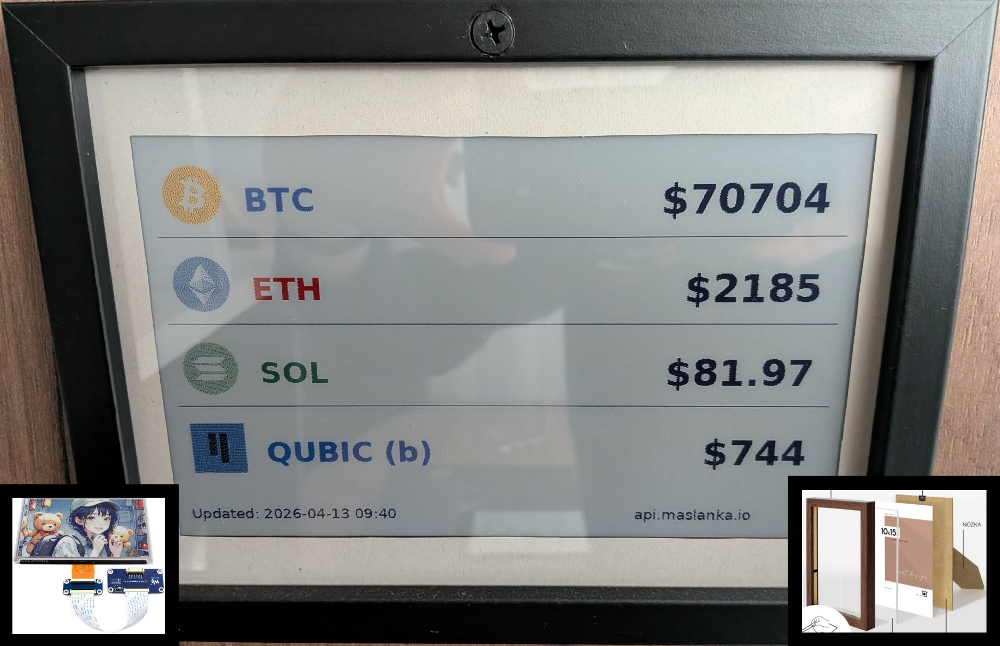

# Crypto Price Tracker for E-Ink Display

A Raspberry Pi project that displays live cryptocurrency prices on a Waveshare 7.3" e-Paper (e-ink) display. Fetches BTC, ETH, SOL, and QUBIC prices from [api.maslanka.io](https://api.maslanka.io) and renders them with colored logos.

<a href="tracker.jpeg"></a>

## Hardware

- Raspberry Pi (tested on Pi 4 / Pi Zero 2 W)
- [Waveshare 7.3inch e-Paper HAT (E)](https://www.waveshare.com/7.3inch-e-paper-hat-e.htm) — 800x480, 6-color
- SPI enabled (`sudo raspi-config` -> Interface Options -> SPI -> Yes)

## Quick Start

```bash
git clone https://github.com/maslankalm/crypto-tracker-diy.git
cd crypto-tracker-diy
bash setup.sh
venv/bin/python refresh_ink.py
```

`setup.sh` creates a virtual environment, installs Python dependencies, clones the [Waveshare e-Paper driver](https://github.com/waveshare/e-Paper), links it so imports work out of the box, and installs a crontab entry to refresh the display every 10 minutes.

## API

Prices are fetched from `https://api.maslanka.io/{COIN}`. Each endpoint returns the current USD price as plain text.